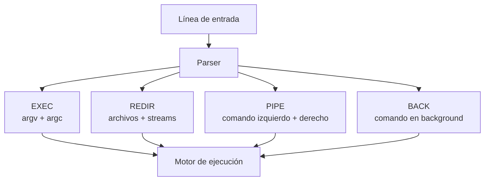
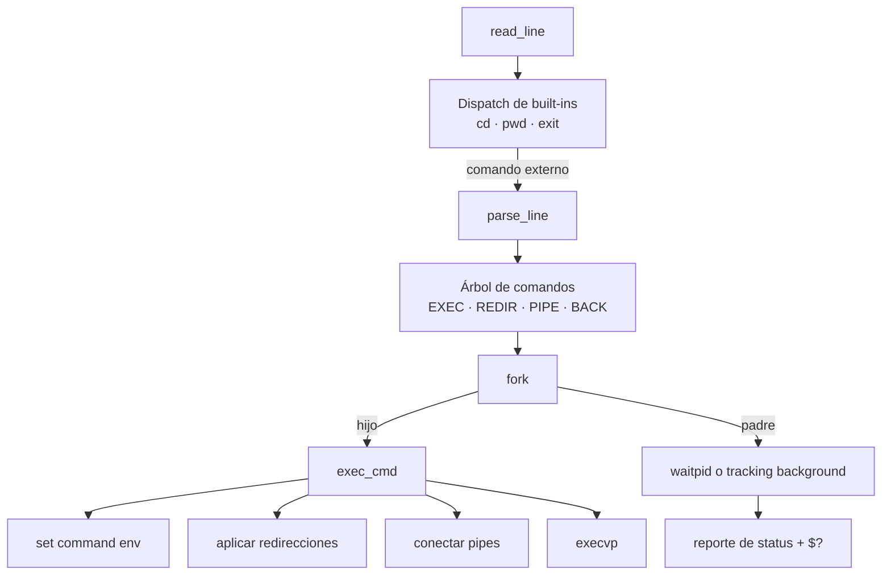

<p align="right">
  <a href="README.md">🇺🇸 English</a> | <strong>🇦🇷 Español</strong>
</p>

# Shell — Intérprete de Comandos Unix

<div align="center">


</div>

---

Una shell tipo Unix implementada en C, enfocada en orquestación de procesos, control de file descriptors, manejo de entorno y testing reproducible de bajo nivel.

## Highlights

> Proyecto de sistemas orientado a backend que muestra los mecanismos de bajo nivel detrás de la ejecución de procesos, pipelines, aislamiento de entornos hijos y flujo de I/O en Unix.

- **Motor de ejecución de procesos**: los comandos se parsean en estructuras explícitas y se ejecutan usando `fork`, `execvp`, `waitpid`, process groups y manejo de procesos en background.
- **Orquestación de pipelines con disciplina de file descriptors**: pipelines de múltiples comandos coordinados con `pipe`, `dup2` y cierre cuidadoso de descriptores para evitar leaks y bloqueos.
- **Redirección de streams estándar**: soporte para stdin, stdout, stderr y `2>&1` mediante manipulación directa de descriptores.
- **Modelo de variables de entorno**: expansión de variables, variables temporales por comando y soporte para `$?` con el status del último comando.
- **Built-ins que modifican estado de la shell**: `cd`, `pwd` y `exit` se manejan en el proceso padre cuando corresponde, respetando la semántica real de Unix.
- **Suite de tests dockerizada**: tests de comportamiento en YAML ejecutados en un contenedor Linux reproducible, cubriendo ejecución, pipes, redirecciones, entorno y leaks de descriptores.

---

## Qué es

Este proyecto es un intérprete compacto de comandos Unix escrito en C. Implementa las responsabilidades centrales de una shell: leer comandos, parsearlos en estructuras ejecutables, crear procesos, conectar flujos de entrada/salida, resolver variables de entorno y reportar estados de ejecución.

Aunque nació como un proyecto académico de programación de sistemas, los problemas de ingeniería que resuelve son directamente relevantes para backend: manejo de ciclo de vida, límites de aislamiento, propagación de errores, limpieza de recursos y comportamiento determinístico al ejecutar procesos concurrentes.

---

## Por qué importa

Gran parte del backend moderno vive por encima de primitivas del sistema operativo, pero los servicios en producción siguen dependiendo de ellas: creación de procesos, streams de I/O, configuración por entorno, exit codes, señales y límites de recursos.

Esta shell vuelve explícitas esas primitivas. En lugar de apoyarse en un framework que oculte la semántica de ejecución, implementa el plano de control directamente: cuándo hacer `fork`, qué estado pertenece al padre, qué descriptores deben heredarse, cuáles deben cerrarse y cómo deben exponerse los errores.

---

## Capacidades

### Parsing Y Ejecución De Comandos

La shell parsea cada línea de entrada en estructuras tipadas:

- **EXEC**: comando normal con argumentos
- **REDIR**: comando con redirección de stdin/stdout/stderr
- **PIPE**: árbol de comandos conectados por un pipe Unix
- **BACK**: comando programado como proceso en background

Esta representación separa el parsing de la ejecución, lo que facilita razonar sobre el comportamiento antes de ejecutar syscalls.



### Manejo De Procesos

Los comandos se ejecutan en procesos hijos para que la shell pueda mantener el control de la sesión. Los comandos foreground se esperan con `waitpid`, mientras que los comandos background se registran por separado y se reportan cuando terminan.

La shell también instala un handler de `SIGCHLD` usando un stack alternativo de señales, permitiendo reportar la finalización de procesos en background sin bloquear el loop principal.

### Pipes Y Redirección De I/O

La implementación de pipelines construye cadenas de comandos usando file descriptors Unix:

- `pipe` crea el canal de comunicación
- `fork` crea los límites entre procesos
- `dup2` conecta stdin/stdout/stderr a los endpoints correctos
- `close` libera descriptores que no deben quedar abiertos
- los comandos `PIPE` anidados arrastran el descriptor de lectura anterior

Este es el problema central de sistemas detrás de pipelines como:

```bash
echo hello | grep he | wc -l
```

El mismo modelo de descriptores permite redirecciones:

```bash
ls /bin/true /noexiste >out.txt 2>&1
cat <input.txt
```

### Manejo De Entorno

La shell soporta comportamiento típico de flujos Unix:

- Expansión de variables como `$HOME`
- Sustitución vacía para variables no definidas
- Asignaciones temporales como `KEY=value command`
- Preservación del entorno del proceso padre cuando se usan variables solo para el hijo
- Expansión de `$?` con el status del último comando foreground

Esto refuerza la diferencia entre estado local de un proceso y estado de la shell padre, un concepto clave para CLIs, workers y launchers de servicios.

### Comandos Built-In

Algunos comandos deben ejecutarse dentro del proceso de la shell porque modifican su estado:

- `cd`: cambia el current working directory de la shell
- `pwd`: imprime el current working directory
- `exit`: termina el loop de la shell

La implementación mantiene esta distinción explícita en lugar de tratar todos los comandos como ejecutables externos.

### Suite De Tests Reproducible

El proyecto incluye un test runner dockerizado con specs YAML. Los tests validan comportamiento en el límite del proceso, no solamente funciones aisladas.

Escenarios cubiertos:

- Ejecución básica de comandos
- Comportamiento de `exit`
- `cd` y `pwd`
- Expansión de variables de entorno
- Propagación de status con `$?`
- Redirección de stdin/stdout/stderr
- `2>&1`
- Redirecciones fallidas que no deben ejecutar el comando
- Pipes y salida de múltiples comandos
- Checks orientados a leaks de file descriptors


---

## Complejidad Técnica

- Parsing de comandos hacia un árbol de ejecución tipado en lugar de ejecución inmediata de strings
- Manejo de ciclo de vida de procesos foreground y background
- Handler de `SIGCHLD` para finalización asíncrona de procesos hijos
- Coordinación de pipelines de múltiples comandos con handoff de descriptores entre nodos
- Redirección de streams para stdin, stdout, stderr y duplicación stderr-to-stdout
- Separación de estado padre-vs-hijo para `cd`, variables temporales y ejecución de procesos
- Propagación de status mediante `$?`
- Wrappers defensivos alrededor de syscalls para centralizar manejo de fallos
- Limpieza explícita de memoria para árboles de comandos y argumentos dinámicos
- Tests de comportamiento dockerizados con escenarios YAML y checks orientados a leaks

---

## Flujo De Arquitectura



---

## Estructura Del Proyecto

```text
shell/
├── sh.c              # ciclo de vida de la shell, prompt, SIGCHLD
├── runcmd.c          # dispatch y control padre/hijo
├── parsing.c         # tokenizer, env expansion, redirecciones y pipes
├── exec.c            # exec, redirecciones, pipelines, background
├── builtin.c         # cd, pwd, exit
├── createcmd.c       # constructores de estructuras de comando
├── freecmd.c         # limpieza del árbol de comandos
├── wrappers.c        # wrappers de syscalls
├── tests/
│   ├── run           # launcher dockerizado
│   ├── test-shell    # test runner Python
│   └── specs/        # specs YAML de comportamiento
├── Dockerfile
└── Makefile
```

---

## Quick Start

### Build

```bash
cd shell
make
```

### Ejecutar

```bash
./sh
```

### Probar Comandos

```bash
pwd
cd /tmp
echo hello | grep he | wc -l
ls /bin/true /noexiste >out.txt 2>&1
KEY=value env | grep KEY
echo $?
```

### Correr Tests

```bash
make test
```

Ejecutar una spec específica:

```bash
make test-env_magic_variable
```

### Helpers De Desarrollo

```bash
make format
make valgrind
make clean
```

---

## Estado

**Proyecto académico de sistemas completo**. El repositorio sirve como showcase backend-oriented de control de ejecución de bajo nivel, aislamiento de procesos, I/O Unix, manejo de recursos y comportamiento testeable en CLI.

> **Nota:** No busca ser un reemplazo productivo de una shell real. Es una implementación enfocada para demostrar fundamentos de sistemas operativos con código C claro e inspeccionable.
