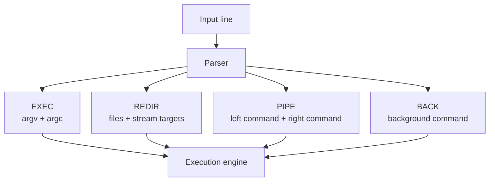
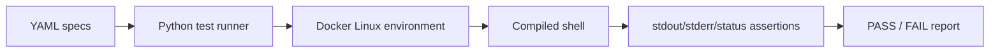
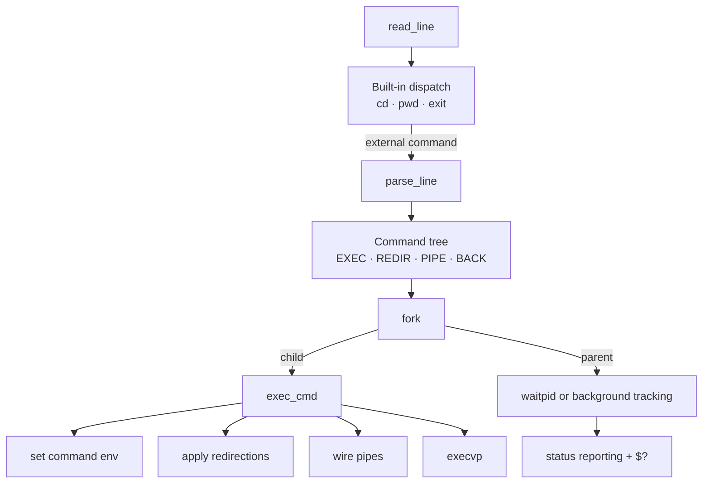

<p align="right">
  <strong>🇺🇸 English</strong> | <a href="README.es.md">🇦🇷 Español</a>
</p>

# Shell — Unix Command Interpreter

<div align="center">


</div>

---

A Unix-like shell implemented in C, focused on process orchestration, file descriptor control, environment handling, and reproducible systems-level testing.

## Highlights

> Backend-oriented systems project that exposes the low-level mechanics behind process execution, command pipelines, isolation of child environments, and Unix I/O flow.

- **Process execution engine**: commands are parsed into explicit command structures and executed through `fork`, `execvp`, `waitpid`, process groups, and background process handling.
- **Pipeline orchestration with file descriptor discipline**: multi-command pipelines are coordinated through `pipe`, `dup2`, and careful descriptor closing to avoid leaks and deadlocks.
- **Redirection support for standard streams**: stdin, stdout, stderr, and `2>&1` redirection are implemented through direct descriptor manipulation.
- **Environment variable model**: supports variable expansion, temporary command-scoped environment variables, and the `$?` status variable used by shell scripts.
- **Built-in commands that mutate shell state**: `cd`, `pwd`, and `exit` are handled in the parent shell where needed, preserving correct process semantics.
- **Dockerized specification test suite**: YAML-based behavioral tests run in a reproducible Linux container and validate execution, pipes, redirection, environment behavior, and descriptor leaks.

---

## What It Is

This project is a compact Unix command interpreter written in C. It implements the core responsibilities of a shell: reading commands, parsing them into executable structures, spawning processes, wiring input/output streams, resolving environment variables, and reporting process status.

Although it is an academic systems programming project, the engineering problems are directly relevant to backend work: lifecycle management, isolation boundaries, error propagation, resource cleanup, and deterministic behavior under concurrent process execution.

---

## Why it matters

Backend engineering often sits above operating system primitives, but production services still depend on them: process creation, I/O streams, environment configuration, exit codes, signals, and resource limits.

This shell makes those primitives explicit. Instead of relying on a framework to hide execution semantics, it implements the control plane directly: when to fork, what state belongs to the parent, which descriptors must be inherited, which must be closed, and how failures should be surfaced.

---

## Capabilities

### Command Parsing And Execution

The shell parses each input line into typed command structures:

- **EXEC**: a normal command with arguments
- **REDIR**: a command with stdin/stdout/stderr redirection
- **PIPE**: a command tree connecting two commands through a Unix pipe
- **BACK**: a command scheduled as a background process

This representation separates parsing from execution, making it easier to reason about command behavior before system calls are performed.



### Process Management

Commands are executed in child processes so the shell can continue controlling the session. Foreground commands are waited with `waitpid`, while background commands are tracked separately and reported when they finish.

The shell also installs a `SIGCHLD` handler using an alternate signal stack, allowing background process completion to be reported without blocking the main command loop.

### Pipes And I/O Redirection

The pipeline implementation builds command chains using Unix file descriptors:

- `pipe` creates the communication channel
- `fork` creates the process boundaries
- `dup2` connects stdin/stdout/stderr to the correct endpoints
- `close` releases descriptors that should not remain open
- nested `PIPE` commands carry the previous read descriptor forward

This is the core systems problem behind shell pipelines like:

```bash
echo hello | grep he | wc -l
```

The same descriptor model supports redirection:

```bash
ls /bin/true /noexiste >out.txt 2>&1
cat <input.txt
```

### Environment Handling

The shell supports environment behavior commonly used in Unix workflows:

- Expansion of variables such as `$HOME`
- Empty substitution for undefined variables
- Temporary environment assignments such as `KEY=value command`
- Preservation of the parent shell environment when child-only variables are used
- `$?` expansion with the status of the previous foreground command

This reinforces the difference between process-local state and parent shell state, a key concept for CLI tools, workers, and service launchers.

### Built-In Commands

Some commands must run inside the shell process itself because they mutate shell state:

- `cd`: changes the current working directory of the shell process
- `pwd`: prints the current working directory
- `exit`: terminates the shell loop

The implementation keeps this distinction explicit instead of treating every command as an external executable.

### Reproducible Test Suite

The project includes a Dockerized test runner with YAML specs. Tests validate behavior at the process boundary rather than only testing isolated functions.

Covered scenarios include:

- Basic command execution
- Exit behavior
- `cd` and `pwd`
- Environment variable expansion
- `$?` status propagation
- stdin/stdout/stderr redirection
- `2>&1`
- Failed redirections that should prevent execution
- Pipes and multi-command output
- File descriptor leak checks



---

## Technical Complexity

- Command parsing into a typed execution tree instead of immediate string execution
- Foreground and background process lifecycle management
- `SIGCHLD` handling for asynchronous child completion
- Multi-command pipeline coordination with descriptor handoff between pipe nodes
- Stream redirection for stdin, stdout, stderr, and stderr-to-stdout duplication
- Parent-vs-child state separation for `cd`, temporary environment variables, and process execution
- Status propagation through `$?`
- Defensive wrappers around system calls to centralize failure handling
- Explicit memory cleanup for command trees and dynamically allocated arguments
- Dockerized behavioral tests with YAML scenarios and leak-oriented checks

---

## Architecture Flow



---

## Project Structure

```text
shell/
├── sh.c              # shell lifecycle, prompt, SIGCHLD handling
├── runcmd.c          # command dispatch and parent/child process control
├── parsing.c         # tokenizer, env expansion, redirection and pipe parsing
├── exec.c            # exec, redirection, pipeline, background execution
├── builtin.c         # cd, pwd, exit
├── createcmd.c       # command structure constructors
├── freecmd.c         # command tree cleanup
├── wrappers.c        # system call wrappers
├── tests/
│   ├── run           # Docker-based test launcher
│   ├── test-shell    # Python test runner
│   └── specs/        # YAML behavior specs
├── Dockerfile
└── Makefile
```

---

## Quick Start

### Build

```bash
cd shell
make
```

### Run

```bash
./sh
```

### Try Commands

```bash
pwd
cd /tmp
echo hello | grep he | wc -l
ls /bin/true /noexiste >out.txt 2>&1
KEY=value env | grep KEY
echo $?
```

### Run Tests

```bash
make test
```

Run a specific spec:

```bash
make test-env_magic_variable
```

### Development Helpers

```bash
make format
make valgrind
make clean
```

---

## Status

**Complete academic systems project**. The repository is useful as a backend-oriented showcase of low-level execution control, process isolation, Unix I/O, resource management, and testable command-line behavior.

> **Note:** This is not a production shell replacement. It is a focused implementation built to demonstrate operating system fundamentals with clean, inspectable C code.
